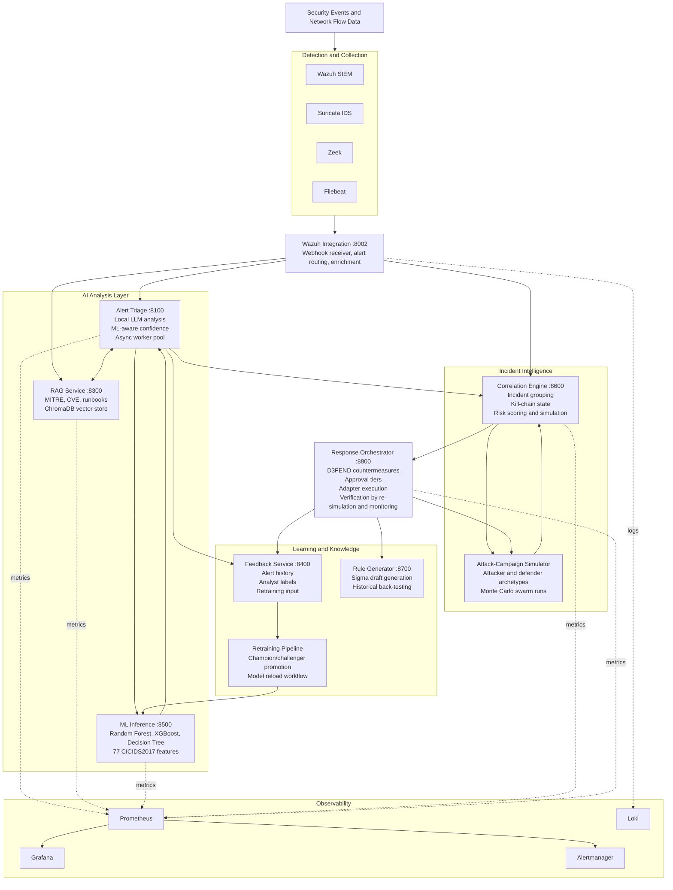

# AI-Augmented Security Operations Center

Local AI services, machine-learning intrusion detection, alert enrichment, attack-campaign simulation, and response planning for security operations.

[](LICENSE)
[](https://www.python.org/downloads/)
[](https://docs.docker.com/compose/)
[](datasets/CICIDS2017/README.md)
[](https://github.com/zhadyz/AI_SOC/actions/workflows/ci.yml)
[](https://codecov.io/gh/zhadyz/AI_SOC)

AI-SOC is a research-grade implementation of an AI-assisted security operations center. It combines trained IDS models, local LLM alert triage, retrieval over security knowledge, Wazuh integration, incident correlation, swarm-scale attack simulation, and a prototype response orchestrator.

The project is intentionally local-first: security event data is processed through local services and Ollama-backed LLM inference rather than a hosted LLM API.

## What This Is

AI-SOC answers one operational question:

> Given a noisy stream of alerts and a modeled environment, which threats matter, how might an attacker proceed, and what defensive action should be considered first?

It does that through several cooperating services:

- ML inference over CICIDS2017-style network-flow features
- LLM alert triage with structured JSON output and confidence reporting
- RAG retrieval over MITRE ATT&CK, CVE data, and security runbooks
- Wazuh alert ingestion and enrichment
- Feedback capture for analyst labels and retraining workflows
- Incident correlation with kill-chain tracking
- Attack-campaign simulation with attacker and defender archetypes
- Response planning with D3FEND mapping and graduated autonomy controls

This is not a drop-in production SOC. It is a substantial research implementation with runnable local services, trained artifacts, documented experiments, and some deliberately stubbed production integrations.

## Current Status

| Area | Status | Notes |
|---|---|---|
| ML inference API | Implemented | FastAPI service using trained Random Forest, XGBoost, and Decision Tree artifacts in `models/`; expects 77 features. |
| Alert triage service | Implemented | FastAPI + Ollama client, ML-aware prompt enrichment, async worker pool, feedback persistence. |
| RAG service | Implemented | ChromaDB-backed retrieval with MITRE, CVE, and runbook ingestion endpoints. |
| Wazuh integration | Implemented | Webhook receiver and alert router for triage/RAG enrichment. |
| Feedback service | Implemented | PostgreSQL-backed alert and analyst-feedback storage. |
| Correlation engine | Implemented | Incident grouping, kill-chain progression, Markov prediction, risk scoring, simulator APIs. |
| Swarm simulation | Research prototype | Monte Carlo leader/follower simulation with attacker and defender archetypes; experiment artifacts included. |
| Response orchestrator | Prototype implemented | D3FEND mapping, plan generation, approval tiers, execution workflow, verification loop. |
| Firewall, EDR, identity adapters | Stubbed | Interfaces exist; production vendor adapters still need real API implementations. |
| Full deployment script | Implemented | `deploy-ai-soc.sh` and `deploy-ai-soc.ps1` orchestrate SIEM, AI services, and monitoring. |

## Architecture



## Repository Layout

```text
.
|-- docker-compose/              Compose stacks for SIEM, AI services, monitoring
|-- services/
|   |-- alert-triage/            LLM alert analysis service
|   |-- rag-service/             Security knowledge retrieval service
|   |-- feedback-service/        Alert and analyst feedback persistence
|   |-- wazuh-integration/       Wazuh webhook/API integration
|   |-- correlation-engine/      Incident grouping, prediction, simulation
|   |-- response-orchestrator/   Defense planning and approval workflow
|   |-- rule-generator/          Sigma rule generation prototype
|   |-- retraining/              Feedback-driven model retraining
|   `-- common/                  Shared security, logging, pipeline utilities
|-- ml_training/                 CICIDS2017 training and inference API
|-- models/                      Trained model and preprocessing artifacts
|-- config/                      Wazuh, Grafana, Prometheus, simulation configs
|-- docs/                        Documentation site content
|-- datasets/                    Dataset notes, validation, checksums
|-- k8s/ai-services/             Kubernetes manifests (AI services only)
|-- terraform/                   Multi-cloud infrastructure (AWS, Azure, GCP)
|-- alembic/                     Database migration scripts
`-- tests/                       Unit, integration, security, browser, load scaffolding
```

## Quick Start

### Requirements

- Docker Engine 23+ and Docker Compose v2
- Python 3.10+ for local development
- 16 GB RAM minimum; 32 GB recommended for the full stack
- 20 GB+ free disk for images, models, and service data
- Linux for the most complete SIEM/network-sensor setup
- Windows/macOS supported for local AI-service development and the Windows-compatible SIEM compose path

### One-command deployment

Linux/macOS:

```bash
git clone https://github.com/zhadyz/AI_SOC.git
cd AI_SOC
./deploy-ai-soc.sh
```

Windows PowerShell:

```powershell
git clone https://github.com/zhadyz/AI_SOC.git
cd AI_SOC
.\deploy-ai-soc.ps1
```

The deployment script performs three phases:

1. Starts the Wazuh SIEM core
2. Builds and starts AI services from `docker-compose/ai-services.yml`
3. Starts the monitoring stack from `docker-compose/monitoring-stack.yml`

It also creates `.env` from `.env.example` when needed, generates local certificates when possible, pulls the configured Ollama model, and triggers RAG knowledge-base ingestion.

### Manual compose deployment

```bash
# SIEM core
docker compose -f docker-compose/phase1-siem-core.yml up -d

# AI services
docker compose -f docker-compose/ai-services.yml up -d --build

# Monitoring
docker compose -f docker-compose/monitoring-stack.yml up -d
```

On Windows or macOS, use:

```bash
docker compose -f docker-compose/phase1-siem-core-windows.yml up -d
```

### Stop the stack

```bash
./deploy-ai-soc.sh --stop
```

or:

```powershell
.\deploy-ai-soc.ps1 -Stop
```

## Service URLs

| Service | URL |
|---|---|
| Wazuh Dashboard | `https://localhost:443` |
| Wazuh Indexer API | `https://localhost:9200` |
| Wazuh API | `https://localhost:55000` |
| Wazuh Integration | `http://localhost:8002/docs` |
| Alert Triage | `http://localhost:8100/docs` |
| RAG Service | `http://localhost:8300/docs` |
| Feedback Service | `http://localhost:8400/docs` |
| ML Inference | `http://localhost:8500/docs` |
| Correlation Engine | `http://localhost:8600/docs` |
| Rule Generator | `http://localhost:8700/docs` |
| Response Orchestrator | `http://localhost:8800/docs` |
| Ollama | `http://localhost:11434` |
| ChromaDB | `http://localhost:8200` |
| Grafana | `http://localhost:3000` |
| Prometheus | `http://localhost:9090` |
| Alertmanager | `http://localhost:9093` |

Default credentials in local compose files are for development only. Change `.env` values before using this outside an isolated lab environment.

## Usage Examples

### Analyze a security alert

```bash
curl -X POST http://localhost:8100/api/v1/triage/analyze \
  -H "Content-Type: application/json" \
  -d '{
    "alert_id": "test-001",
    "rule_description": "SSH brute force attack detected",
    "rule_level": 10,
    "source_ip": "203.0.113.42",
    "dest_ip": "10.0.1.50",
    "dest_port": 22,
    "raw_log": "Failed password for root from 203.0.113.42 port 45678 ssh2"
  }'
```

Expected response shape:

```json
{
  "alert_id": "test-001",
  "severity": "high",
  "category": "intrusion_attempt",
  "confidence": 0.92,
  "summary": "SSH brute force activity from 203.0.113.42 against root login",
  "is_true_positive": true,
  "iocs": [
    {
      "ioc_type": "ip",
      "value": "203.0.113.42",
      "confidence": 0.95
    }
  ],
  "mitre_techniques": ["T1110.001"],
  "recommendations": [
    {
      "action": "Block source IP at the perimeter firewall",
      "priority": 1,
      "rationale": "Prevents continued brute-force attempts from the same source"
    }
  ]
}
```

### Run ML inference directly

The inference API expects exactly 77 flow features in the trained feature order stored in `models/feature_names.pkl`.

```bash
python - <<'PY'
import json
import urllib.request

payload = json.dumps({
    "features": [0.0] * 77,
    "model_name": "random_forest",
}).encode()

request = urllib.request.Request(
    "http://localhost:8500/predict",
    data=payload,
    headers={"Content-Type": "application/json"},
)

print(urllib.request.urlopen(request, timeout=10).read().decode())
PY
```

The all-zero vector is only a smoke-test payload. Real predictions should use the trained feature order in `models/feature_names.pkl`.

### Retrieve knowledge-base context

```bash
curl -X POST http://localhost:8300/api/v1/rag/retrieve \
  -H "Content-Type: application/json" \
  -d '{
    "query": "credential dumping LSASS memory",
    "collection": "mitre_attack",
    "top_k": 3
  }'
```

### Submit analyst feedback

```bash
curl -X POST http://localhost:8400/api/v1/feedback/feedback/test-001 \
  -H "Content-Type: application/json" \
  -d '{
    "analyst_id": "analyst1",
    "is_false_positive": false,
    "true_label": "ATTACK",
    "notes": "Confirmed brute-force source"
  }'
```

### Correlate alerts and inspect incidents

```bash
curl http://localhost:8600/api/v1/correlation/incidents
curl http://localhost:8600/api/v1/correlation/predict/reconnaissance
```

### Run attack-campaign simulation

```bash
# Single campaign
curl -X POST "http://localhost:8600/api/v1/correlation/simulate?timesteps=3"

# Swarm simulation
curl -X POST "http://localhost:8600/api/v1/correlation/simulate/swarm/start?swarm_size=100&monte_carlo_runs=5&timesteps=6"

# Poll status
curl "http://localhost:8600/api/v1/correlation/simulate/swarm/SWARM-ID/status"

# Fetch result
curl "http://localhost:8600/api/v1/correlation/simulate/swarm/SWARM-ID/result"
```

### Trigger response planning

```bash
curl -X POST http://localhost:8800/api/v1/response/defend \
  -H "Content-Type: application/json" \
  -d '{
    "incident_id": "INC-20250324-ab12",
    "auto_execute": false,
    "dry_run": true
  }'
```

Use dry-run mode while evaluating the response orchestrator. Firewall, EDR, and identity actions are adapter stubs unless replaced with production integrations.

## ML Results

The ML baseline is trained on CICIDS2017-style network-flow data with binary `BENIGN` vs `ATTACK` classification.

| Model | Accuracy | False Positive Rate | Notes |
|---|---:|---:|---|
| Random Forest | 99.28% | 0.25% | Best overall balance in current artifacts. |
| XGBoost | 99.21% | 0.09% | Lowest false-positive rate. |
| Decision Tree | 99.10% | 0.50% | Interpretable baseline. |

Artifacts:

- `models/random_forest_ids.pkl`
- `models/xgboost_ids.pkl`
- `models/decision_tree_ids.pkl`
- `models/scaler.pkl`
- `models/label_encoder.pkl`
- `models/feature_names.pkl`

Training and deployment notes:

- [ml_training/README.md](ml_training/README.md)
- [ml_training/inference_api.py](ml_training/inference_api.py)
- [docs/ml-models.md](docs/ml-models.md)

## Swarm Simulation

The correlation engine includes a research prototype for multi-agent attack-campaign simulation:

- Four attacker archetypes: opportunist, APT, ransomware, insider
- Three defender archetypes: SOC analyst, incident responder, threat hunter
- Leader/follower Monte Carlo design for scaling agent runs
- Environment randomization for defense and vulnerability uncertainty
- Host risk heatmaps, attack-path frequencies, confidence intervals, and defense-effectiveness summaries

Experiment artifacts are stored under `services/correlation-engine/experiments_v3/`.

| Finding | Result |
|---|---|
| Total agent runs | 37,575 |
| Unique attack paths discovered | 18 |
| Model-scale effect | 14B model found more unique paths than 3B |
| Defender impact | 44% overall reduction in compromise, 93% reduction on monitored hosts |

The simulator is useful for prioritization, research, and what-if analysis. It should not be treated as a replacement for penetration testing, adversary emulation, or production risk scoring without additional validation.

See [docs/swarm-simulation.md](docs/swarm-simulation.md) for details.

## Response Orchestration

The response orchestrator turns detected techniques and simulation output into candidate defensive actions:

1. Fetch incident context from the correlation engine
2. Optionally run simulation
3. Map ATT&CK techniques to D3FEND countermeasures
4. Score actions by impact, safety, and confidence
5. Assign an approval tier
6. Execute auto-safe actions or queue human-required actions
7. Verify outcome through re-simulation and monitoring
8. Record outcome for feedback

Approval tiers:

| Tier | Behavior |
|---|---|
| Observe | Log only. |
| Recommend | Analyst decides. |
| Auto-safe | Low-blast action may execute automatically. |
| Auto-veto | Medium-blast action can execute with a veto window. |
| Human-required | Analyst approval required. |

Safety invariant: actions affecting critical assets or high-blast actions require human approval regardless of model confidence.

## Testing

Install test dependencies:

```bash
pip install -r tests/requirements.txt
```

Run the full suite:

```bash
pytest tests/
```

Current testing notes:

- Browser, load, and integration tests require the relevant local services to be running.

## Security Notes

AI-SOC is built for a lab/research environment unless hardened further.

Before production-like use:

- Replace every default password in `.env`
- Keep `.env`, generated certificates, and credentials out of git
- Enable TLS where services communicate across hosts
- Review container network boundaries and host-network sensor settings
- Replace response-action stubs with audited vendor integrations
- Validate LLM output before using it for automated action
- Treat ML predictions from alert metadata as low confidence unless full 77-feature flow data is present

See [docs/security.md](docs/security.md) for the full security guide.

## Known Gaps

- Production firewall, EDR, and identity adapters are not implemented.
- Adversarial ML evasion testing has not been completed.
- The ML model is binary only; multi-class attack labeling remains future work.
- Simulator results have not been benchmarked against real red-team outcomes.
- Feedback-loop protection against bad or malicious labels is not implemented.
- Longitudinal evidence for retraining improvement requires operational data over time.

## Documentation

| Topic | Link |
|---|---|
| Getting Started | [docs/getting-started.md](docs/getting-started.md) |
| Architecture | [docs/architecture.md](docs/architecture.md) |
| Services | [docs/services.md](docs/services.md) |
| API Reference | [docs/api-reference.md](docs/api-reference.md) |
| ML Models | [docs/ml-models.md](docs/ml-models.md) |
| Deployment | [docs/deployment.md](docs/deployment.md) |
| Configuration | [docs/configuration.md](docs/configuration.md) |
| Security | [docs/security.md](docs/security.md) |
| Swarm Simulation | [docs/swarm-simulation.md](docs/swarm-simulation.md) |
| Development | [docs/development.md](docs/development.md) |

To serve the documentation locally:

```bash
pip install mkdocs mkdocs-material
mkdocs serve
```

## License

Apache License 2.0. See [LICENSE](LICENSE).
