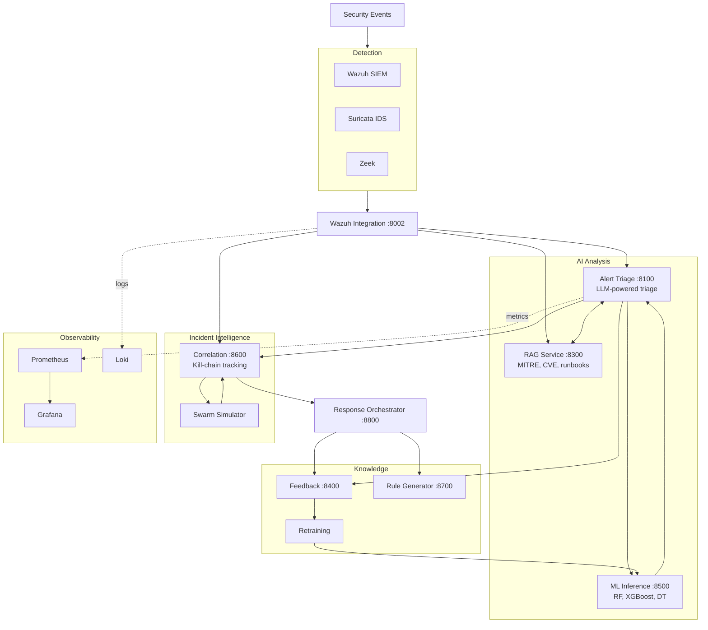

d# Argus

AI-Augmented Security Operations Center — ML intrusion detection, LLM alert triage, and automated response orchestration.

[](LICENSE)
[](https://www.python.org/downloads/)
[](https://github.com/AyoubHamrouni/Argus/actions/workflows/ci.yml)

## What is Argus?

Argus is a local-first AI security platform. It takes noisy security alerts and answers three questions:

1. **Is this real?** — ML models classify network flows and alerts as benign or attack
2. **What's happening?** — LLM triage produces severity, MITRE mapping, and analyst-facing summaries
3. **What do we do?** — Response orchestrator generates defense plans with D3FEND countermeasures

Everything runs locally. No data leaves your network.

## Quick Start

### Try the demo (no Docker needed)

```bash
git clone https://github.com/AyoubHamrouni/Argus.git
cd Argus
python -m venv .venv && source .venv/bin/activate
pip install -e .
argus demo
```

This runs a synthetic pipeline showing 5 attack scenarios through ML classification, LLM triage, MITRE mapping, and response planning.

### Run against live services

```bash
# Start the AI stack
argus up

# Run the demo against live services
argus demo --live
```

### Full deployment

```bash
./deploy-argus.sh
```

## Architecture



## CLI Reference

```bash
argus demo              # Synthetic demo (no Docker)
argus demo --live       # Demo against running services
argus up                # Start AI services
argus up --profile full # Start SIEM + AI + monitoring
argus down              # Stop services
argus status            # Check service health
argus health            # Detailed health checks
argus logs [service]    # Tail logs
argus test-data -o alerts.json  # Generate synthetic alerts
argus deploy            # Full deployment
```

## Repository Layout

```text
argus/                  CLI package (pip installable)
services/
├── alert-triage/       LLM alert analysis
├── rag-service/        Security knowledge retrieval
├── ml-inference/       ML model serving
├── feedback-service/   Alert and analyst feedback
├── correlation-engine/ Incident grouping, kill-chain
├── response-orchestrator/ Defense planning
├── rule-generator/     Sigma rule generation
├── wazuh-integration/  Wazuh webhook/API bridge
└── common/             Shared auth, logging, caching
docker-compose/         Compose stacks (SIEM, AI, monitoring)
ml_training/            CICIDS2017 training + inference API
models/                 Trained model artifacts
config/                 Wazuh, Grafana, Prometheus configs
docs/                   Documentation site
tests/                  Unit, integration, e2e, security tests
k8s/                    Kubernetes manifests
terraform/              Multi-cloud IaC (AWS, Azure, GCP)
evaluation/             ML evaluation artifacts
scripts/                Setup and utility scripts
```

## Service URLs

| Service | URL | Purpose |
|---------|-----|---------|
| Alert Triage | `http://localhost:8100/docs` | LLM-powered alert analysis |
| RAG Service | `http://localhost:8300/docs` | MITRE/CVE/runbook retrieval |
| ML Inference | `http://localhost:8500/docs` | Network flow classification |
| Wazuh Integration | `http://localhost:8002/docs` | Alert ingestion webhook |
| Feedback Service | `http://localhost:8400/docs` | Analyst feedback storage |
| Correlation Engine | `http://localhost:8600/docs` | Incident correlation |
| Response Orchestrator | `http://localhost:8800/docs` | Defense plan generation |
| Rule Generator | `http://localhost:8700/docs` | Sigma rule drafting |
| Grafana | `http://localhost:3000` | Dashboards |
| Prometheus | `http://localhost:9090` | Metrics |

## Usage

### Analyze an alert

```bash
curl -X POST http://localhost:8100/api/v1/triage/analyze \
  -H "Content-Type: application/json" \
  -d '{
    "alert_id": "test-001",
    "rule_description": "SSH brute force detected",
    "rule_level": 10,
    "source_ip": "203.0.113.42",
    "dest_ip": "10.0.1.50",
    "dest_port": 22,
    "raw_log": "Failed password for root from 203.0.113.42"
  }'
```

### Classify a network flow

```bash
curl -X POST http://localhost:8500/predict \
  -H "Content-Type: application/json" \
  -d '{"features": [0.0]*77, "model_name": "random_forest"}'
```

### Query the knowledge base

```bash
curl -X POST http://localhost:8300/api/v1/rag/retrieve \
  -H "Content-Type: application/json" \
  -d '{"query": "credential dumping LSASS", "top_k": 3}'
```

## ML Results

Trained on CICIDS2017, binary BENIGN vs ATTACK classification (77 features).

| Model | Accuracy | FPR | Notes |
|-------|----------|-----|-------|
| Random Forest | 99.28% | 0.25% | Best balance |
| XGBoost | 99.21% | 0.09% | Lowest false positives |
| Decision Tree | 99.10% | 0.50% | Interpretable baseline |

See `evaluation/` for confusion matrices, ROC curves, and detailed metrics.

## Testing

```bash
pip install -e ".[dev]"
pytest tests/unit/ -v                    # Unit tests
pytest tests/integration/ -v             # Integration tests
pytest tests/unit/ tests/integration/ -v # All runnable tests
```

## Requirements

- Docker 23+ and Docker Compose v2 (for service deployment)
- Python 3.10+ (for CLI and local development)
- 16 GB RAM minimum, 32 GB recommended
- Linux for full SIEM; macOS/Windows for AI services only

## Security

Argus runs in a lab/research configuration by default. Before production use:

- Replace all default passwords in `.env`
- Enable TLS between services
- Validate LLM output before automated action
- Treat ML predictions as low-confidence without full 77-feature flow data

See [docs/security.md](docs/security.md).

## License

Apache License 2.0 — see [LICENSE](LICENSE).

Built by [Ayoub Hamrouni](https://github.com/AyoubHamrouni).
