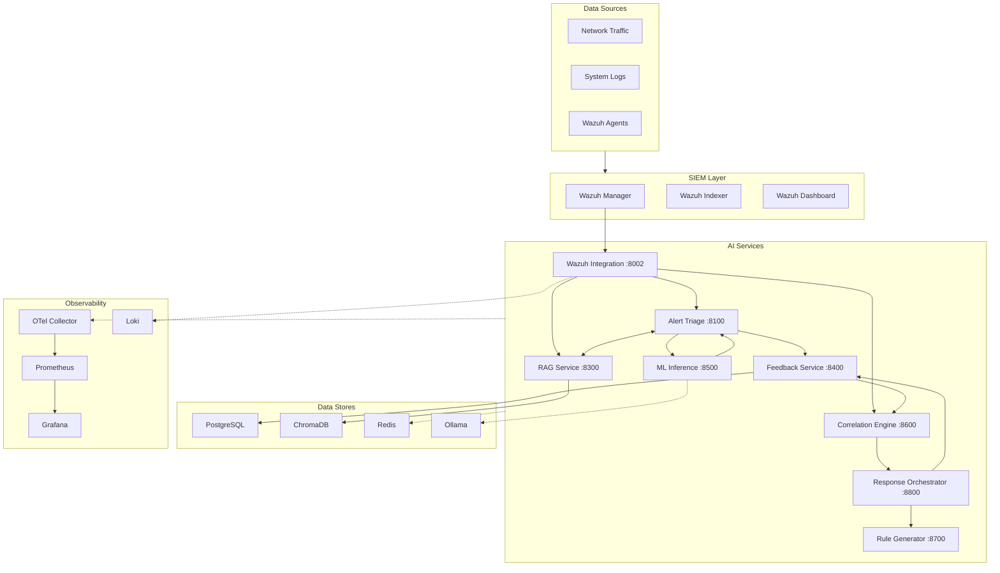

# Architecture

## Design Principles

- **Microservices**: Each service has a single responsibility and can be scaled independently
- **Local-first**: All processing runs locally — no external LLM APIs required (Ollama-backed)
- **API-first**: Every service exposes a REST API with auto-generated OpenAPI docs
- **Observable**: Prometheus metrics, structured logging, and OpenTelemetry distributed tracing on every service
- **Secure by default**: JWT + API key auth, rate limiting, input validation, prompt injection detection

## System Overview



## Service Communication

All inter-service communication is synchronous HTTP via REST APIs. Services discover each other through Docker Compose service names (e.g., `http://alert-triage:8000`).

```
Wazuh Integration
  ├── POST /api/v1/triage/analyze   → Alert Triage
  ├── POST /api/v1/rag/retrieve     → RAG Service
  └── POST /api/v1/correlation/correlate → Correlation Engine

Alert Triage
  ├── POST /api/v1/rag/retrieve     → RAG Service (context enrichment)
  ├── POST /predict                 → ML Inference (ML confidence)
  └── POST /api/v1/feedback/alerts  → Feedback Service (persistence)

Correlation Engine
  ├── GET  /api/v1/response/plans   → Response Orchestrator
  └── POST /simulate/swarm/start    → Self (simulation)

Response Orchestrator
  ├── GET  /api/v1/correlation/incidents/{id} → Correlation Engine
  └── POST /api/v1/rules/generate   → Rule Generator
```

## API Versioning

All service endpoints are versioned under `/api/v1/{service}/`:

| Service | Base Path |
|---------|-----------|
| Alert Triage | `/api/v1/triage/` |
| RAG Service | `/api/v1/rag/` |
| Feedback Service | `/api/v1/feedback/` |
| Correlation Engine | `/api/v1/correlation/` |
| Response Orchestrator | `/api/v1/response/` |
| Wazuh Integration | `/api/v1/wazuh/` |
| Rule Generator | `/api/v1/rules/` |

Health and metrics endpoints remain unversioned at `/health` and `/metrics`.

## Authentication

Every service endpoint (except `/health` and `/metrics`) requires authentication via:

- **JWT Bearer token**: `Authorization: Bearer <token>`
- **API Key**: `X-API-Key: <key>`

Roles: `admin`, `analyst`, `viewer`

Scoped access per service (e.g., `triage:read`, `correlation:write`, `rag:ingest`).

See [security.md](security.md) for details.

## Data Flow

### Alert Processing Pipeline

```
Wazuh Alert
  → Wazuh Integration (webhook received)
    → Alert Triage (LLM analysis: severity, category, IOCs, MITRE mapping)
      → ML Inference (network flow classification if features available)
      → RAG Service (retrieve relevant threat intel)
    → Feedback Service (store alert + triage results)
    → Correlation Engine (group into incidents, track kill-chain)
      → Response Orchestrator (map to D3FEND, generate plan)
        → Rule Generator (draft Sigma rules)
```

### ML Inference Pipeline

```
Feature Vector (77 CICIDS2017 features)
  → Scaler (StandardScaler)
    → Model (Random Forest / XGBoost / Decision Tree)
      → Prediction (BENIGN / ATTACK)
        → Confidence score
```

### Simulation Pipeline

```
Environment Model (hosts, vulnerabilities, defenses)
  → Attacker Archetype (opportunist / APT / ransomware / insider)
    → LLM-powered strategy decisions
      → Rule-based follower exploration
        → Monte Carlo aggregation
          → Risk scores, attack paths, defense effectiveness
```

## Infrastructure

### Kubernetes (AI Services Only)

Kubernetes manifests are in `k8s/ai-services/` for the 7 AI microservices + Redis. SIEM infrastructure (Wazuh, Suricata) runs outside Kubernetes.

```bash
kubectl apply -k k8s/ai-services/
```

### Terraform

Multi-cloud infrastructure modules in `terraform/`:

| Provider | Backend | Resources |
|----------|---------|-----------|
| AWS | S3 + DynamoDB | VPC, RDS PostgreSQL, EKS |
| Azure | Blob Storage | VNet, Azure Database for PostgreSQL, AKS |
| GCP | GCS | VPC, Cloud SQL, GKE |

See [terraform/README.md](../terraform/README.md) for provider-specific setup.
