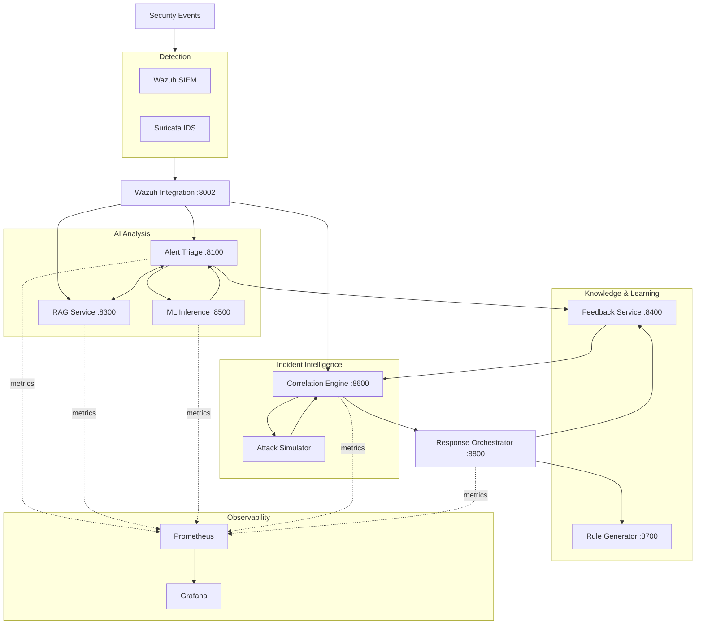

# AI-Augmented Security Operations Center

An open-source platform that combines machine learning intrusion detection, LLM-powered alert triage, retrieval-augmented threat intelligence, and automated response orchestration — all running locally.

[](https://github.com/zhadyz/AI_SOC/blob/main/LICENSE)
[](https://github.com/zhadyz/AI_SOC/actions/workflows/ci.yml)
[](https://codecov.io/gh/zhadyz/AI_SOC)

---

## What This Does

AI-SOC answers a single operational question:

> Given a noisy stream of alerts and a modeled environment, which threats matter, how might an attacker proceed, and what defensive action should be considered first?

It does this through eight cooperating microservices:

| Service | Purpose |
|---------|---------|
| **ML Inference** | Network flow classification using trained Random Forest, XGBoost, and Decision Tree models (77 CICIDS2017 features) |
| **Alert Triage** | LLM-powered alert analysis with structured JSON output, IOC extraction, and MITRE ATT&CK mapping |
| **RAG Service** | Semantic search over MITRE ATT&CK, CVE data, and security runbooks via ChromaDB |
| **Wazuh Integration** | Webhook receiver for Wazuh SIEM alert ingestion and routing |
| **Feedback Service** | Analyst feedback capture, alert history, and retraining input |
| **Correlation Engine** | Incident grouping, kill-chain tracking, risk scoring, and attack simulation |
| **Response Orchestrator** | D3FEND countermeasure mapping, approval tiers, and execution workflow |
| **Rule Generator** | Sigma rule draft generation and back-testing |

---

## Architecture



---

## Quick Start

### Requirements

- Docker Engine 23+ and Docker Compose v2
- Python 3.10+ for local development
- 16 GB RAM minimum (32 GB recommended)
- 20 GB+ free disk space

### Deploy

```bash
git clone https://github.com/zhadyz/AI_SOC.git
cd AI_SOC
cp .env.example .env
./deploy-ai-soc.sh
```

Or deploy manually:

```bash
docker compose -f docker-compose/phase1-siem-core.yml up -d
docker compose -f docker-compose/ai-services.yml up -d --build
docker compose -f docker-compose/monitoring-stack.yml up -d
```

### Stop

```bash
./deploy-ai-soc.sh --stop
```

---

## Service URLs

| Service | URL |
|---------|-----|
| Wazuh Dashboard | `https://localhost:443` |
| Wazuh API | `https://localhost:55000` |
| Alert Triage | `http://localhost:8100/docs` |
| RAG Service | `http://localhost:8300/docs` |
| Feedback Service | `http://localhost:8400/docs` |
| Correlation Engine | `http://localhost:8600/docs` |
| Response Orchestrator | `http://localhost:8800/docs` |
| Wazuh Integration | `http://localhost:8002/docs` |
| Rule Generator | `http://localhost:8700/docs` |
| ML Inference | `http://localhost:8500/docs` |
| Ollama | `http://localhost:11434` |
| ChromaDB | `http://localhost:8200` |
| Grafana | `http://localhost:3000` |
| Prometheus | `http://localhost:9090` |

---

## Documentation

| Topic | Link |
|-------|------|
| Getting Started | [getting-started.md](getting-started.md) |
| Architecture | [architecture.md](architecture.md) |
| Services | [services.md](services.md) |
| API Reference | [api-reference.md](api-reference.md) |
| ML Models | [ml-models.md](ml-models.md) |
| Deployment | [deployment.md](deployment.md) |
| Configuration | [configuration.md](configuration.md) |
| Security | [security.md](security.md) |
| Development | [development.md](development.md) |
| Swarm Simulation | [swarm-simulation.md](swarm-simulation.md) |
| Changelog | [changelog.md](changelog.md) |

---

## License

Apache License 2.0. See [LICENSE](https://github.com/zhadyz/AI_SOC/blob/main/LICENSE).
